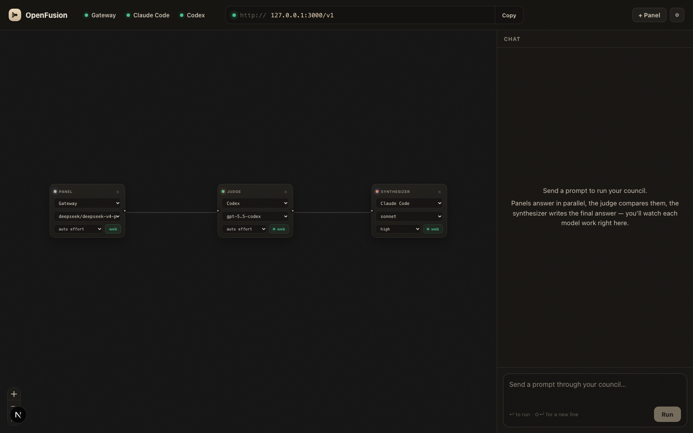

# OpenFusion

Run a Fusion-style model council on your own machine, and call it like one model.

You compose a council on a canvas: panel models answer in parallel, an optional judge compares the answers, and a synthesizer writes the final response. Cursor, aider, Continue, OpenCode, and your own agents call that council through one local OpenAI-compatible endpoint.

The pattern comes from [OpenRouter Fusion](https://openrouter.ai/docs/guides/features/server-tools/fusion). OpenFusion is the local version you can open and rewire: the studio, graph, logs, and endpoint run on your machine, and each node runs through a source you choose: Vercel AI Gateway, OpenRouter, Claude Code, or Codex.



## Why this exists

Some prompts benefit from more than one model. OpenRouter's Fusion made that measurable: on their DRACO run, they reported a budget panel of Gemini 3 Flash, Kimi K2.6, and DeepSeek V4 Pro beating solo GPT-5.5 and solo Opus 4.8, and Opus 4.8 fused with itself scoring 65.5% versus 58.8% solo. OpenFusion has not reproduced those numbers; it builds around the same pattern.

The difference is where it runs and who controls it. Their pipeline is hosted. OpenFusion is a graph you can open, edit, and own:

- You choose the panel, the judge, and the synthesizer. There is no hidden preset you cannot open.
- You bring your own access. One Vercel AI Gateway or OpenRouter key covers hosted models, and your Claude Code and Codex subscriptions run as real council nodes through their official CLIs.
- You see every run: each node's output, tool calls, tokens, latency, failures, and cost estimates when the provider exposes enough metadata.

No OpenFusion hosted account. No vendor lock-in. Your graph, your keys, your subscriptions, your endpoint.

## Quickstart

```bash
git clone https://github.com/divyaran7an/openfusion.git
cd openfusion
npm install
npm run dev
```

Open the studio:

```text
http://127.0.0.1:3000
```

Connect at least one source:

- **Vercel AI Gateway**: paste a [key](https://vercel.com/ai-gateway) into the studio, or set `AI_GATEWAY_API_KEY`.
- **OpenRouter**: paste a [key](https://openrouter.ai/settings/keys) into the studio, or set `OPENROUTER_API_KEY`.
- **Claude Code and Codex**: sign in once (`claude auth login`, `codex login`). The studio detects the CLIs automatically and runs them as council nodes.

The canvas opens with a default council: three panels, a judge, and a synthesizer, all on Vercel AI Gateway. Rewire it, run a test prompt, then point your tools at the endpoint.

## How it works

```text
prompt
  |
  +--> panel model
  +--> panel model
  +--> panel model
          |
          v
     optional judge
          |
          v
     synthesizer
          |
          v
       answer
```

- **Panel** models (1 to 8) answer in parallel.
- The **judge** does not write the answer. It compares: consensus, contradictions, partial coverage, unique insights, and blind spots. It always runs at temperature 0, and only when more than one panel response exists.
- The **synthesizer** writes the final response from the judge analysis, or straight from the panel when no judge is wired.

Panel and judge nodes default to web tools on; the synthesizer defaults to web tools off, so it writes from the earlier work instead of doing a fresh search pass.

Failures are honest: if a panelist fails, the run continues and is marked degraded. If every panel model fails, or the graph is not runnable, the call fails loudly with the reason instead of guessing.

## What you can wire

Every node is a source plus a model.

| Source | What it is for |
| --- | --- |
| Vercel AI Gateway | API-billed models like GPT, Claude, Gemini, DeepSeek, Qwen, and more |
| OpenRouter | API-billed OpenRouter models, routers, and server-side search/fetch tools |
| Claude Code | Your local Claude Code subscription through the official `claude` CLI |
| Codex | Your local Codex subscription through the official `codex` CLI |

A council needs at least one panel model and exactly one synthesizer. The judge is optional, but earns its seat once you have more than one panel model. Mix sources freely: a Claude Code panelist next to a Vercel AI Gateway model, with a Codex synthesizer, is a normal graph.

You can use the studio presets, or ignore them and build your own graph.

## Use it from your editor, CLI, or agent

OpenFusion speaks the OpenAI API. Point any OpenAI-compatible client at:

```text
Base URL:  http://127.0.0.1:3000/v1
API key:   local-fusion    (any string; only enforced if you set FUSION_API_KEYS)
Model:     openfusion      (any name works; every request runs your active graph)
```

The model name is a label. `/v1/models` advertises `openfusion`, `fusion`, and `openrouter/fusion`, but whatever id your client sends, OpenFusion runs the council currently on the canvas. Both `POST /v1/chat/completions` and `POST /v1/responses` run that same graph.

### curl

```bash
curl http://127.0.0.1:3000/v1/chat/completions \
  -H 'Authorization: Bearer local-fusion' \
  -H 'Content-Type: application/json' \
  -d '{"model":"openfusion","messages":[{"role":"user","content":"Where would this architecture fail?"}]}'
```

Add `"stream": true` for standard OpenAI SSE, terminated by `[DONE]`. Streaming chunks also carry a `fusion_event` extension with live council progress (`panel.started`, `judge.finished`, and so on); clients that do not know about it ignore it.

### OpenAI SDK

```python
from openai import OpenAI

client = OpenAI(base_url="http://127.0.0.1:3000/v1", api_key="local-fusion")
resp = client.chat.completions.create(
    model="openfusion",
    messages=[{"role": "user", "content": "Where would this plan fail?"}],
)
print(resp.choices[0].message.content)
```

```ts
import OpenAI from "openai";

const client = new OpenAI({ baseURL: "http://127.0.0.1:3000/v1", apiKey: "local-fusion" });
const resp = await client.chat.completions.create({
  model: "openfusion",
  messages: [{ role: "user", content: "Review this architecture." }],
});
console.log(resp.choices[0].message.content);
```

Clients on the newer Responses API work too; `POST /v1/responses` bridges to the same council:

```ts
const response = await client.responses.create({
  model: "openfusion",
  instructions: "Be direct.",
  input: "Review this architecture.",
});
console.log(response.output_text);
```

### Vercel AI SDK

```ts
import { createOpenAICompatible } from "@ai-sdk/openai-compatible";
import { generateText } from "ai";

const openfusion = createOpenAICompatible({
  name: "openfusion",
  baseURL: "http://127.0.0.1:3000/v1",
  apiKey: "local-fusion",
});

const { text } = await generateText({
  model: openfusion("openfusion"),
  prompt: "Review this migration plan for failure modes.",
});
```

### Inside an agent

Anything your framework calls an OpenAI-compatible provider works: set the base URL, key, and model, and the council answers as one model. The details agents care about:

- **Function tools pass through.** OpenAI `type: "function"` tools are forwarded to the synthesizer and returned as standard `tool_calls`. OpenFusion never executes your tools server-side; your agent keeps control of execution, and follow-up `tool` messages are preserved as context.
- **Structured output is enforced.** `response_format` with `json_object` or `json_schema` is validated before the response returns. A final answer that misses the contract fails the request instead of handing your parser junk.
- **Conversation history works.** Send the full `messages` transcript like any chat model. Prior turns become context; the last user message is the task.
- **Stop actually stops.** Cancelling the request aborts every upstream model call, so an interrupted agent step does not keep spending.

### Editors and CLIs

Cursor, aider, Continue.dev, and OpenCode all take the same three values above. Copy-paste configs for each, plus troubleshooting for clients with model allowlists (`FUSION_MODEL_ALIASES`), live in [docs/SETUP.md](docs/SETUP.md). A zero-dependency terminal chat client lives in [examples/chat](examples/chat).

## The studio

The studio is not meant to be another chat app. It is where you shape the endpoint.

- connect Vercel AI Gateway, OpenRouter, Claude Code, and Codex
- drag models onto the canvas
- choose each node's role, model, thinking effort, and tools
- run a test prompt and watch every node work
- see tokens, latency, tool calls, failures, and cost estimates when available
- stop a run and cancel upstream model calls

Once the graph looks right, point your tools at `/v1/chat/completions` or `/v1/responses` and use it like one model.

## Models

The studio ships a small verified shortlist per source so the first run is not guesswork. Any id your source accepts works through the Custom ID option; there is no allowlist to fight.

| Source | Examples |
| --- | --- |
| Vercel AI Gateway | `anthropic/claude-fable-5`, `anthropic/claude-opus-4.8`, `openai/gpt-5.5`, `google/gemini-3.1-pro-preview`, `moonshotai/kimi-k2.6` |
| OpenRouter | `anthropic/claude-fable-5`, `anthropic/claude-opus-4.8`, `openai/gpt-5.5`, `google/gemini-3.1-pro-preview`, `openrouter/auto` |
| Claude Code | `fable`, `opus`, `sonnet`, `haiku` |
| Codex | `gpt-5.5`, `gpt-5.5-codex` |

Yes, that includes `anthropic/claude-fable-5`. The moment a catalog lists a new model, it is one Custom ID away from being a panelist, the judge, or your synthesizer.

The live catalogs are the source of truth:

```bash
curl https://ai-gateway.vercel.sh/v1/models
curl https://openrouter.ai/api/v1/models
```

More model notes, per-node thinking budgets, and one-click preset councils live in [docs/MODELS.md](docs/MODELS.md).

## OpenRouter Fusion compatibility

Already using OpenRouter's Fusion shapes? They work here as-is: `model: "openrouter/fusion"`, the `plugins: [{ "id": "fusion", ... }]` config with `analysis_models`, the `openrouter:fusion` server tool, the `general-high` / `general-budget` / `general-fast` presets, and OpenRouter-style `web_search` and `web_fetch` parameters. The full contract is in [docs/API.md](docs/API.md).

## Safety boundaries

OpenFusion is local developer software. Run it on `127.0.0.1` unless you have added real production auth and isolation.

The `/v1` endpoints send permissive CORS headers like other local OpenAI servers, so browser-based clients work out of the box. The flip side: with auth off, any web page open in your browser can reach the endpoint and spend your provider credits. Set `FUSION_API_KEYS` to gate it.

The Claude Code and Codex harnesses use the official local CLIs. They run in read-only mode. OpenFusion does not scrape tokens, automate subscription UIs, or mutate your files through those harnesses.

The built-in local tools can inspect allowed project roots. They do not write files.

The web fetch path blocks private IPs, caps response size, filters MIME types, follows redirect limits, and treats fetched content as untrusted.

See [SECURITY.md](SECURITY.md) before exposing anything beyond your own machine.

## Inspired by OpenRouter

OpenFusion is inspired by OpenRouter's Fusion work:

- [Fusion API announcement](https://openrouter.ai/blog/announcements/fusion-beats-frontier/)
- [Fusion plugin docs](https://openrouter.ai/docs/guides/features/plugins/fusion)
- [Fusion server tool docs](https://openrouter.ai/docs/guides/features/server-tools/fusion)
- [Fusion router docs](https://openrouter.ai/docs/guides/routing/routers/fusion-router)

Their work showed the pattern is worth building around. OpenFusion is the local orchestration layer you can rewire.

## Docs

- [Setup](docs/SETUP.md)
- [Models](docs/MODELS.md)
- [API](docs/API.md)
- [Architecture](docs/ARCHITECTURE.md)
- [Principles](PRINCIPLES.md)
- [Security](SECURITY.md)
- [Contributing](CONTRIBUTING.md)

## Contributors

- [Divya Ranjan](https://x.com/divyaranjan_) - creator and maintainer
- [Alex Yao](https://x.com/TheAlexYao) - contributor
- [Rohan Mehta](https://x.com/RowRowRoUrBoat) - contributor

## License

MIT.

Built with [Pattrns.ai](https://pattrns.ai) by [@divyaranjan_](https://x.com/divyaranjan_).
