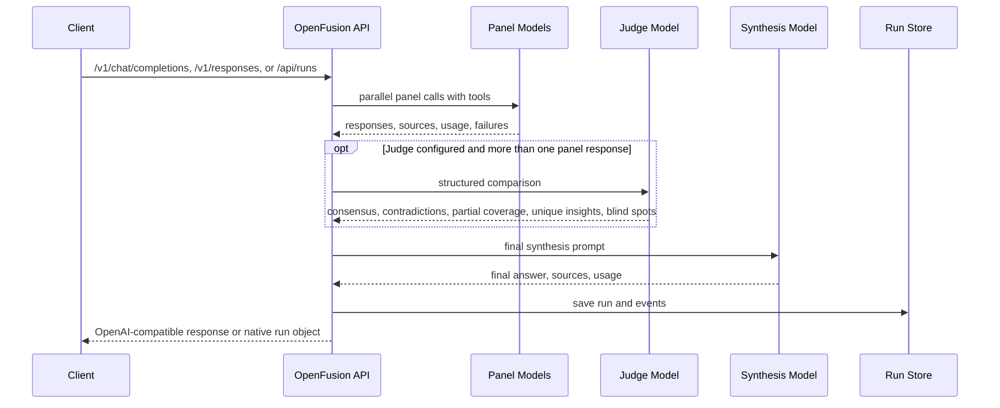

# Architecture

OpenFusion is a local orchestration gateway for compound-model calls. It keeps the OpenAI-compatible facade, workflow templates, Fusion-style deliberation engine, provider calls, tools, storage, and admin UI separate enough to change one layer without rewriting the rest.

## Request Flow



The admin UI is not the main chat product. It is a single-page local studio for provider readiness, workflow diagrams, real test runs, and saved traces. Clients consume OpenFusion by setting their OpenAI-compatible base URL to `/v1`.

OpenFusion follows the same high-level pattern as OpenRouter's Fusion: panel models first, an optional judge when configured, then a synthesizer.

## Core Layers

### API Facade

Routes:

- `/v1/models`
- `/v1/chat/completions`
- `/v1/responses`
- `/api/mcp` (stateless Streamable HTTP MCP server exposing the `deep_consensus` tool)
- `/api/health`
- `/api/graph` (GET/PUT, read and write the active council graph)
- `/api/threads`
- `/api/threads/:id`
- `/api/runs`
- `/api/runs/stream`
- `/api/runs/:id`
- `/api/runs/:id/events`

Every run entry point — `/v1/chat/completions`, `/v1/responses`, `/api/runs`, `/api/runs/stream`, and the MCP tool — applies the same active-graph merge (`src/lib/fusion/active-graph.ts`): the canvas graph drives the run, an explicit request-level override with panel models wins, and an unrunnable graph fails loudly instead of falling back to a preset.

The OpenAI-compatible routes map public model IDs to the active graph. `/v1/chat/completions` returns standard chat-completion envelopes with a `fusion` metadata extension. `/v1/responses` translates Responses-style text input and function tools into the same execution path, then returns Responses-style output objects or streaming events.

The canonical public model name is the graph name `openfusion`. `/v1/models` advertises only `openfusion`, `fusion`, `openrouter/fusion`, plus explicit `FUSION_MODEL_ALIASES` entries. Chat requests and model retrieval accept arbitrary client model strings and route them to the active graph, so clients can keep their preferred labels. Older preset aliases still resolve for existing configs, but they are not advertised.

### Workflow and Deliberation Engine

The current workflow engine runs the active graph saved by the studio. Legacy preset names still exist only as compatibility targets for older clients and internal run paths. The product concept is a callable workflow, not a fixed chat mode.

Direct fusion flow:

1. Resolve mode and preset.
2. Apply per-request Fusion overrides.
3. Call panel models in parallel.
4. Preserve partial panel failures.
5. Hard-fail only when every panel model fails.
6. Ask the judge for structured analysis when more than one useful panel response exists.
7. Mark the run degraded if a panel member or judge fails.
8. Ask the synthesis model for the final answer.
9. Save usage, sources, latency, cost estimate, provider metadata, and trace events.

Agentic Fusion flow:

1. Resolve the outer model.
2. Attach a `fusionTool` internal tool.
3. Let the outer model decide whether to invoke Fusion unless a specific Fusion tool choice forces it.
4. Return client `tool_calls` when the client supplies OpenAI function tools.
5. Preserve panel, judge, source, usage, latency, and failure metadata on the saved run.

Hosted synthesizers use native provider tool calling through the AI SDK. Claude Code and Codex synthesizers run through a structured JSON bridge because the CLI harnesses are one-shot print adapters, not native OpenAI tool transports. Forced client tool calls fail clearly if the harness does not return the expected tool-call object.

### Provider Layer

Current provider execution uses:

- AI SDK `generateText`
- Vercel AI Gateway via `gateway(model)`
- OpenRouter via `createOpenRouter`
- AI SDK `Output.object` for judge JSON
- AI SDK `stepCountIs` for tool-loop caps
- Vercel AI Gateway web search when supported
- OpenRouter server-side `web_search` and `web_fetch` for OpenRouter nodes
- optional Parallel extraction
- built-in `webFetch`
- bounded local read/list/search tools

Panel and judge nodes default to web tools on. Synthesizer nodes default to web tools off, so the final answer is written from panel outputs and judge analysis rather than a fresh search pass. Users can override each node's web toggle on the canvas or through the graph config.

Codex and Claude Code run as council nodes through their official local CLIs in read-only mode with web tools enabled where supported (`claude -p --safe-mode --no-session-persistence --tools "WebSearch WebFetch" --allowedTools "WebSearch WebFetch"` on a current CLI, `codex exec --ignore-user-config --ignore-rules -s read-only -c tools.web_search=true`), normalized into the same result shape as hosted calls. Both arg builders are capability-aware: the harness probes each installed CLI's help output once and drops robustness flags an older build rejects, surfacing the degradation as `cli_warnings` in `/api/health` instead of failing the seat opaquely. Security-critical flags are never dropped — Codex always runs with `-s read-only`, and a Claude build without tool restriction is warned about loudly. They sit behind the same provider boundary as Vercel AI Gateway and OpenRouter nodes: local harness processes, not hidden HTTP APIs, never granted file edits, write access, or approval loops.

Harness environment resolution is centralized in `src/lib/fusion/harness.ts`. Health checks and actual runs use the same source-specific home/env handling:

- `FUSION_CODEX_HOME` sets `CODEX_HOME` for Codex.
- `FUSION_CLAUDE_CODE_HOME` sets `HOME` for Claude Code.
- `FUSION_CODEX_ENV_JSON` and `FUSION_CLAUDE_CODE_ENV_JSON` merge source-specific env variables into only that harness process.
- Ambient billing-routing variables (`ANTHROPIC_*`, `OPENAI_API_KEY`, `OPENAI_BASE_URL`, `OPENAI_AUTH_TOKEN`, `CODEX_API_KEY`, Bedrock/Vertex switches) are stripped from harness child processes before the overlay applies. A gateway token in the user's shell cannot silently reroute a subscription seat; explicit rerouting goes through the env JSON only.

The health check proves local readiness: executable found, and a local auth footprint or provider credential env present. It does not spend a model call to prove the remote subscription is usable. Codex runs ignore user config and project execpolicy rules at execution time, so stale local config should not block a council run. The first run is the authority for upstream account, quota, and provider policy failures.

This is intentionally smaller than T3 Code's full session harness. OpenFusion runs one-shot, read-only panel calls, so it needs deterministic environment isolation and diagnostics, not long-lived interactive provider sessions.

### Tool Layer

Local tools:

- `localList`
- `localRead`
- `localSearch`

They are read-only, root-scoped, size-limited, and secret-denying.

Web tools:

- Vercel AI Gateway search
- OpenRouter server-side search/fetch
- optional Parallel extraction
- built-in `webFetch`

`webFetch` validates redirects, blocks localhost/private-network targets, filters non-text MIME types, caps response bytes, caches briefly in memory, extracts citation metadata, and labels fetched content as untrusted external data. It is not a browser and does not authenticate, execute JavaScript, bypass robots, or parse arbitrary binary documents.

### Storage

Storage is in-memory by default, or Redis through:

```bash
KV_REST_API_URL=
KV_REST_API_TOKEN=
```

Saved objects include runs, run events, thread records, thread-run indexes, provider metadata, sources, panel responses, failures, usage, and cost coverage.

The live event bus is process-local. Completed traces can be persisted; active stream subscribers are not coordinated across multiple Node processes yet.

## Fusion Compatibility

Implemented:

- `openrouter/fusion` router alias
- `openrouter:fusion` server tool
- `fusion:fusion` public server tool
- `plugins: [{ id: "fusion" }]`
- `analysis_models`, `model`, `preset`, `enabled`, `max_tool_calls`, `max_completion_tokens`, `temperature`, and accepted `reasoning` config
- `openrouter:web_search` and `openrouter:web_fetch` parsing
- neutral independent panel prompts in strict Fusion paths
- 1 to 8 panel models
- degraded success on partial panel or judge failure
- hard failure when no panel model returns useful output
- OpenAI function-tool passthrough
- multi-step client tool result continuation
- provider generation metadata and cost coverage when Vercel AI Gateway or OpenRouter returns it

Partial:

- `reasoning` config is parsed for compatibility; source-specific node effort is forwarded for Vercel AI Gateway, OpenRouter, Codex, and Claude Code.
- Exa and Firecrawl are parsed as requested engines. OpenRouter nodes forward supported OpenRouter server-tool config; Vercel AI Gateway nodes route through available Vercel AI Gateway/Parallel paths.
- Real-client compatibility should be checked manually against the clients you intend to support.
- Cost is authoritative only when Vercel AI Gateway or OpenRouter generation lookup covers all expected provider calls; otherwise it is an estimate with explicit coverage metadata.

Not implemented (by design):

- interactive shell/edit/browser harness sessions. OpenFusion drives the CLIs read-only only
- durable cross-process live event coordination
- authenticated browser fetch
- hosted multi-tenant deployment hardening
- benchmark claims that OpenFusion beats frontier systems

## Subscription Boundary

The economic angle: panel/judge/synthesizer work can run through Claude Code and Codex plan-backed local CLIs instead of hosted per-token API spend, while Vercel AI Gateway and OpenRouter cover everything else through normal provider billing.

Current state:

- Vercel AI Gateway and OpenRouter nodes are API-billed; Claude Code and Codex nodes run through the signed-in local CLI and count against that provider's plan, limits, and credit rules.
- Codex and Claude Code execute as real council nodes today (read-only mode with web tools enabled where supported), normalized into the same result shape as hosted calls.
- If Claude Code is explicitly pointed at OpenRouter or another gateway through `FUSION_CLAUDE_CODE_ENV_JSON` (`ANTHROPIC_AUTH_TOKEN` etc.), that Claude Code run is gateway-billed and no longer uses the Claude subscription for that process. Ambient shell tokens cannot do this — they are stripped from harness children, so the boundary only moves when the user moves it explicitly.
- Optional spend caps (`FUSION_BUDGET_DAILY_USD`, `FUSION_BUDGET_MONTHLY_USD`) enforce the boundary economically: hosted spend is recorded in an append-only local ledger, new hosted runs are refused with 402 once a UTC window's recorded spend reaches the cap, and plan-billed harness seats are exempt by model classification.
- Bare `provider/model` ids route to Vercel AI Gateway for backwards compatibility. `openrouter/provider/model` ids route to OpenRouter.

The harness boundary holds:

- a harness connects only when its official CLI is installed and local auth or provider credentials are present (auto-detected; opt out with `FUSION_*_HARNESS=0`)
- it uses the official local client in read-only print mode, with no shell, file edits, approvals, or browser
- runs surface timeouts, events, transcripts, scratch workspaces, and provenance
- it records billing/allocation state when the provider exposes it
- never scrape browser cookies, hidden tokens, or subscription web UIs

## Research Grounding

Relevant public sources:

- [OpenRouter Fusion blog](https://openrouter.ai/blog/announcements/fusion-beats-frontier/)
- [OpenRouter Fusion router](https://openrouter.ai/docs/guides/routing/routers/fusion-router)
- [OpenRouter Fusion server tool](https://openrouter.ai/docs/guides/features/server-tools/fusion)
- [OpenRouter Fusion plugin](https://openrouter.ai/docs/guides/features/plugins/fusion)
- [DRACO](https://arxiv.org/abs/2602.11685)
- [Using Codex with your ChatGPT plan](https://help.openai.com/en/articles/11369540-using-codex-with-your-chatgpt-plan)
- [Claude Code with Pro or Max](https://support.claude.com/en/articles/11145838-use-claude-code-with-your-pro-or-max-plan)

OpenRouter reported two useful DRACO observations that inform this repo's direction:

- A budget Fusion panel of Gemini 3 Flash, Kimi K2.6, and DeepSeek V4 Pro beat solo GPT-5.5 and solo Opus 4.8 on their DRACO run.
- Fusing Opus 4.8 with itself scored 65.5% versus 58.8% for solo Opus 4.8, a 6.7 point lift in their setup.

DRACO is a useful deep-research benchmark, but it is not proof that this repo matches OpenRouter's published scores. Do not claim frontier parity, "beats frontier," or "half the price" without this repo's own reproducible benchmarks against the exact shipped configuration.

## Benchmarking Bar

Before broad quality claims, OpenFusion needs reproducible benchmarks for:

- deep research with source freshness
- architecture review
- security review
- implementation planning
- hallucination resistance
- contaminated-source resistance
- partial panel failure
- judge failure
- cost and latency envelopes

Current checks prove wiring, contracts, and metadata. They do not prove model-quality superiority.

## Module Map

| Path | Responsibility |
| --- | --- |
| `src/lib/fusion/models.ts` | workflow aliases, compatibility presets, panel defaults |
| `src/lib/fusion/fusion-config.ts` | OpenRouter/Fusion config parsing |
| `src/lib/fusion/orchestrator.ts` | direct and agentic fusion execution |
| `src/lib/fusion/provider.ts` | Vercel AI Gateway/OpenRouter calls and model tools |
| `src/lib/fusion/web-tools.ts` | hardened public URL fetch |
| `src/lib/fusion/local-tools.ts` | bounded local inspection tools |
| `src/lib/fusion/openai-handler.ts` | OpenAI-compatible request handling |
| `src/lib/fusion/schemas.ts` | runtime contracts |
| `src/lib/fusion/store.ts` | in-memory/Redis persistence |
| `src/lib/fusion/harness.ts` | Codex/Claude Code auto-detection + capability boundary + billing env isolation |
| `src/lib/fusion/harness-run.ts` | read-only Codex/Claude Code CLI execution, normalized; CLI capability probe |
| `src/lib/fusion/active-graph.ts` | the shared active-graph merge every run entry point applies |
| `src/lib/fusion/budget.ts` | append-only spend ledger + pre-flight budget guard |
| `src/lib/fusion/mcp-handler.ts` | stateless Streamable HTTP MCP server (`deep_consensus`) |
| `src/lib/fusion/graph.ts` | the canvas graph model: nodes, validation, graph to override |
| `src/lib/fusion/graph-store.ts` | durable local persistence of the active graph |
| `src/app/api/graph/route.ts` | GET/PUT the active graph the endpoint runs |
| `src/components/FusionStudio.tsx` | the React Flow node studio (the single page) |
