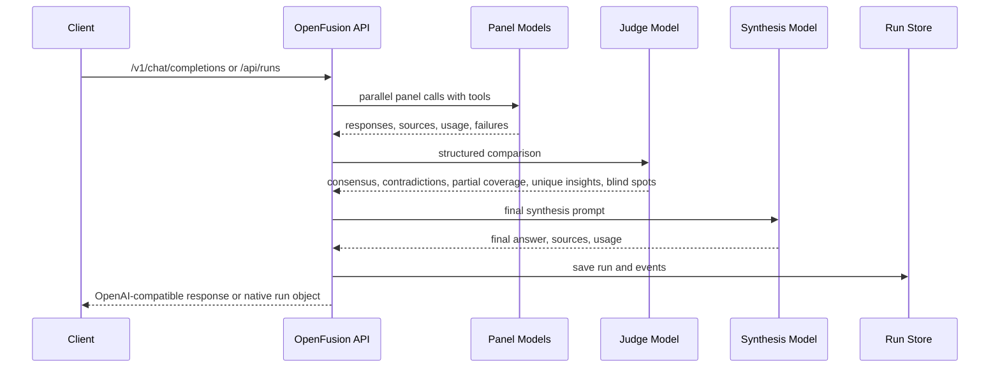

# Architecture

OpenFusion is a local compound-model gateway. It keeps the OpenAI-compatible facade, workflow templates, Fusion-style deliberation engine, provider calls, tools, storage, and admin UI separate enough to change one layer without rewriting the rest.

## Request Flow



The admin UI is not the main chat product. It is a single-page local studio for provider readiness, workflow diagrams, real test runs, and saved traces. Clients consume OpenFusion by setting their OpenAI-compatible base URL to `/v1`.

OpenFusion's panel → judge → synthesizer pipeline is faithful to (and inspired by) OpenRouter's Fusion.

## Core Layers

### API Facade

Routes:

- `/v1/models`
- `/v1/chat/completions`
- `/api/health`
- `/api/graph` (GET/PUT, read and write the active council graph)
- `/api/threads`
- `/api/threads/:id`
- `/api/runs`
- `/api/runs/stream`
- `/api/runs/:id`
- `/api/runs/:id/events`

The OpenAI-compatible route maps public model IDs to modes and returns standard chat-completion envelopes with a `fusion` metadata extension. The metadata name is retained for compatibility with existing clients and stored records.

The canonical public model name is the graph name `fusion`. Compatibility aliases include `fusion/*`, the short aliases, and `openrouter/fusion`.

### Workflow and Deliberation Engine

The current workflow engine exposes built-in templates through model aliases. Internally those templates still map to `fast`, `research`, `fusion-3`, and `fusion-8` compatibility modes, but the product concept is a callable workflow, not a fixed chat mode.

Direct fusion flow:

1. Resolve mode and preset.
2. Apply per-request Fusion overrides.
3. Call panel models in parallel.
4. Preserve partial panel failures.
5. Hard-fail only when every panel model fails.
6. Ask the judge for structured analysis when more than one useful panel response exists.
7. Mark the run degraded if a panel member or judge fails.
8. Ask the synthesis model for the final answer.
9. Save usage, sources, latency, cost estimate, provider metadata, and trace events.

Agentic Fusion flow:

1. Resolve the outer model.
2. Attach a `fusionTool` internal tool.
3. Let the outer model decide whether to invoke Fusion unless a specific Fusion tool choice forces it.
4. Return client `tool_calls` untouched when the client supplies OpenAI function tools.
5. Preserve panel, judge, source, usage, latency, and failure metadata on the saved run.

### Provider Layer

Current provider execution uses:

- AI SDK `generateText`
- Vercel AI Gateway via `gateway(model)`
- AI SDK `Output.object` for judge JSON
- AI SDK `stepCountIs` for tool-loop caps
- Gateway web search when supported
- optional Parallel extraction
- built-in `webFetch`
- bounded local read/list/search tools

Codex and Claude Code run as council nodes through their official local CLIs in read-only mode with web search built in (`claude -p --tools "WebSearch WebFetch" --allowedTools "WebSearch WebFetch"`, `codex exec -s read-only -c tools.web_search=true`), normalized into the same result shape as Gateway calls. As agents they ground their answers in current sources, but sit behind the same provider boundary as Gateway nodes: local harness processes, not hidden HTTP APIs, never granted file edits, write access, or approval loops.

### Tool Layer

Local tools:

- `localList`
- `localRead`
- `localSearch`

They are read-only, root-scoped, size-limited, and secret-denying.

Web tools:

- Gateway search
- optional Parallel extraction
- built-in `webFetch`

`webFetch` validates redirects, blocks localhost/private-network targets, filters non-text MIME types, caps response bytes, caches briefly in memory, extracts citation metadata, and labels fetched content as untrusted external data. It is not a browser and does not authenticate, execute JavaScript, bypass robots, or parse arbitrary binary documents.

### Storage

Storage is in-memory by default, or Redis through:

```bash
KV_REST_API_URL=
KV_REST_API_TOKEN=
```

Saved objects include runs, run events, thread records, thread-run indexes, provider metadata, sources, panel responses, failures, usage, and cost coverage.

The live event bus is process-local. Completed traces can be persisted; active stream subscribers are not coordinated across multiple Node processes yet.

## Fusion Compatibility

Implemented:

- `openrouter/fusion` router alias
- `openrouter:fusion` server tool
- `fusion:fusion` public server tool
- `plugins: [{ id: "fusion" }]`
- `analysis_models`, `model`, `preset`, `enabled`, `max_tool_calls`, `max_completion_tokens`, `temperature`, and accepted `reasoning` config
- `openrouter:web_search` and `openrouter:web_fetch` parsing
- neutral independent panel prompts in strict Fusion paths
- 1 to 8 panel models
- degraded success on partial panel or judge failure
- hard failure when no panel model returns useful output
- OpenAI function-tool passthrough
- multi-step client tool result continuation
- provider generation metadata and cost coverage when Gateway returns it

Partial:

- `reasoning` config is parsed but provider-specific forwarding is not complete.
- Exa and Firecrawl are parsed as requested engines, but current execution routes through available Gateway/Parallel paths.
- Real-client compatibility should be checked manually against the clients you intend to support.
- Cost is authoritative only when Gateway generation lookup covers all expected provider calls; otherwise it is an estimate with explicit coverage metadata.

Not implemented (by design):

- interactive shell/edit/browser harness sessions. OpenFusion drives the CLIs read-only only
- durable cross-process live event coordination
- authenticated browser fetch
- hosted multi-tenant deployment hardening
- benchmark claims that OpenFusion beats frontier systems

## Subscription Boundary

The economic angle: panel/judge/synthesizer work can run on flat-rate Claude Code and Codex subscriptions instead of per-token API spend.

Current state:

- Gateway nodes are API-billed; Claude Code and Codex nodes run on your subscription via the local CLI.
- Codex and Claude Code execute as real council nodes today (read-only mode with built-in web search), normalized into the same result shape as Gateway calls.
- The default `openai/gpt-5.5` and `anthropic/claude-opus-4.8` values are Gateway model IDs.

The harness boundary holds:

- a harness connects only when its official CLI is installed and signed in (auto-detected; opt out with `FUSION_*_HARNESS=0`)
- it uses the official local client in read-only print mode, with no shell, file edits, approvals, or browser
- runs surface timeouts, events, transcripts, scratch workspaces, and provenance
- it records billing/allocation state when the provider exposes it
- never scrape browser cookies, hidden tokens, or subscription web UIs

## Research Grounding

Relevant public sources:

- [OpenRouter Fusion blog](https://openrouter.ai/blog/announcements/fusion-beats-frontier/)
- [OpenRouter Fusion router](https://openrouter.ai/docs/guides/routing/routers/fusion-router)
- [OpenRouter Fusion server tool](https://openrouter.ai/docs/guides/features/server-tools/fusion)
- [OpenRouter Fusion plugin](https://openrouter.ai/docs/guides/features/plugins/fusion)
- [DRACO](https://arxiv.org/abs/2602.11685)
- [Using Codex with your ChatGPT plan](https://help.openai.com/en/articles/11369540-using-codex-with-your-chatgpt-plan)
- [Claude Code with Pro or Max](https://support.claude.com/en/articles/11145838-use-claude-code-with-your-pro-or-max-plan)

DRACO is a useful deep-research benchmark, but it is not proof that this repo matches OpenRouter's published scores. Do not claim frontier parity, "beats frontier," or "half the price" without this repo's own reproducible benchmarks against the exact shipped configuration.

## Benchmarking Bar

Before broad quality claims, OpenFusion needs reproducible benchmarks for:

- deep research with source freshness
- architecture review
- security review
- implementation planning
- hallucination resistance
- contaminated-source resistance
- partial panel failure
- judge failure
- cost and latency envelopes

Current checks prove wiring, contracts, and metadata. They do not prove model-quality superiority.

## Module Map

| Path | Responsibility |
| --- | --- |
| `src/lib/fusion/models.ts` | workflow aliases, compatibility presets, panel defaults |
| `src/lib/fusion/fusion-config.ts` | OpenRouter/Fusion config parsing |
| `src/lib/fusion/orchestrator.ts` | direct and agentic fusion execution |
| `src/lib/fusion/provider.ts` | AI SDK/Gateway calls and model tools |
| `src/lib/fusion/web-tools.ts` | hardened public URL fetch |
| `src/lib/fusion/local-tools.ts` | bounded local inspection tools |
| `src/lib/fusion/openai-handler.ts` | OpenAI-compatible request handling |
| `src/lib/fusion/schemas.ts` | runtime contracts |
| `src/lib/fusion/store.ts` | in-memory/Redis persistence |
| `src/lib/fusion/harness.ts` | Codex/Claude Code auto-detection + capability boundary |
| `src/lib/fusion/harness-run.ts` | read-only Codex/Claude Code CLI execution, normalized |
| `src/lib/fusion/graph.ts` | the canvas graph model: nodes, validation, graph→override |
| `src/lib/fusion/graph-store.ts` | durable local persistence of the active graph |
| `src/app/api/graph/route.ts` | GET/PUT the active graph the endpoint runs |
| `src/components/FusionStudio.tsx` | the React Flow node studio (the single page) |
